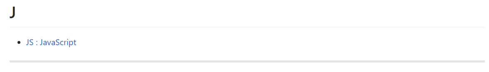

# Comment contribuer ?

## Il est important de bien comprendre la structure du projet :

Chaque abréviation ou acronyme (par exemple, 'ONU') doit posséder son propre fichier Markdown. Ce fichier doit se trouver dans le dossier correspondant à la première lettre de l'abréviation ou de l'acronyme, dans le dossier `Dico`.

De plus, le fichier [bdd.md](bdd.md) recense tous les fichiers déjà existants dans le dictionnaire. Avant d'en créer un nouveau, vérifiez qu'il n'existe pas. Il faut également ajouter vos nouveaux fichiers à cette base. Voir ci-dessous pour la méthode.

## Il est important de respecter les règles de format :

Chaque fichier doit être nommé ainsi : `abréviation.md` (par exemple, pour l'ONU, le fichier s'appelle `onu.md`). De plus, les fichiers eux-mêmes ont une structure bien précise :

    # ABRÉVIATION

    --------------------

    ## (1) Forme entière, avec les lettres qui correspondent à l'acronyme en majuscule

    **Domaine(s)** : Domaine1 / Domaine2 / etc

    **En lien** : // Optionnel

    + [abréviation ou acronyme en majuscule](../Dico/Lettre/NomDuFichier.md) : description courte du lien
    + etc

    **Remarque(s)** : // Optionnel
    + Remarque1
    + Remarque2
    + etc

    --------------------

    ## (2) Forme entière, avec les lettres qui correspondent à l'acronyme en majuscule

    .....

    --------------------

    etc

## Exemple :

    # SIDA

    --------------------

    ## (1) Syndrome d'ImmunoDéficience Acquise

    **Domaine(s)** : Sciences / Médecine

    **En lien** :

    + [VIH](../Dico/V/vih.md) : virus de base

    --------------------

*Contenu du fichier `Dico/S/sida.md`.*

## Méthode pour les ajouts à la base de données :

Une fois votre nouveau fichier terminé, il faut le recenser dans le fichier [bdd.md](bdd.md). Pour ce faire, il suffit d'aller dans la section de la première lettre de votre fichier et d'ajouter le votre selon la même méthode. Voyons un exemple : vous voulez ajouter le fichier `jfk.md` à la base de donnée.

1. Vous vous rendez dans le fichier.
2. Vous accédez à la section `#J`.
3. Vous voyez ceci : 
4. Vous déterminez où placer votre entrée, dans l'ordre alphabétique. Ici, "JFK" sera avant "JS".
5. Vous entrez ceci sur une nouvelle ligne : `+ [JFK : John Fitz Kennedy](/Dico/J/jfk.md)`.

*Note : dans le cas où votre abréviation / acronyme existerait déjà et aurait donc déjà son propre fichier, ajoutez simplement "/ Autre Abréviation".*

## Comment vérifier qu'un fichier existe déjà ou non :

Il y a dans le dossier py un fichier nommé [recherche.py](/py/recherche.py). Celui-ci permet deux choses :

+ Rechercher si un fichier existe ou non (en complément du fichier [bdd.md](/bdd.md) qui lui donne les noms entiers allant avec les abréviations) ;
+ Faire une recherche par domaine. Si vous voulez savoir, par exemple, quelles abréviations de manga existent, il est là pour vous aider !

## Pour ceux qui ne voudraient ou ne sauraient pas gérer la création des fichiers :

Il y a, dans l'onglet 'Projets' un [projet](https://github.com/Bethoth/Dico-abreviations-et-acronymes/projects/1) permettant à chacun d'ajouter toutes les abréviations qu'il souhaite. Pour contribuer ici, je vous demande de donner :

+ L'abréviation
+ Les mots correspondants
+ Les domaines

Pour ce qui est des liens, vous pouvez également en proposer.